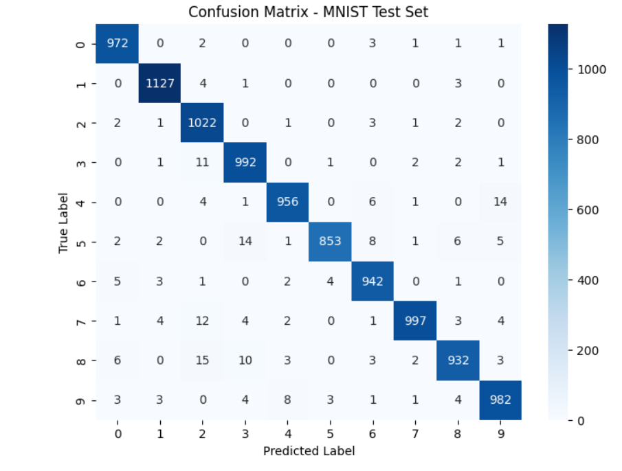

# SE4050 – Deep Learning – Lab Sheet 2

## Lab 2: Introduction to Backpropagation and Feed-Forward Neural Networks

---

## Exercise 1: Backprop.ipynb

**Objective**
Understand a manual backpropagation implementation and observe how increasing the number of iterations (epochs) affects prediction accuracy.

**Setup**

| | |
|---|---|
| Environment | Anaconda (conda env `se4050`, Python 3.10) |
| Packages | `tensorflow`, `numpy`, `matplotlib`, `seaborn`, `scikit-learn`, `jupyter`, `notebook` |

**What was done**

The notebook trains a simple 2-2-2 feed-forward network (2 inputs, 2 hidden units, 2 outputs) using manual forward propagation and backpropagation, based on Matt Mazur's step-by-step backpropagation example. The `no_of_iter` parameter inside `initialize()` was increased from its default value of 100, and the notebook was rerun at three different values to compare results.

**Results**

| Iterations | Final Output | Desired Output | Error |
|:---:|:---:|:---:|:---:|
| 100 | [0.178, 0.8771] | [0.01, 0.99] | 0.0205 |
| 1,000 | [0.0447, 0.9569] | [0.01, 0.99] | 0.00115 |
| 10,000 | [0.0162, 0.9839] | [0.01, 0.99] | 0.0000379 |

<table>
<tr>
<td align="center"><b>100 iterations</b> </td>
<td align="center"><b>1,000 iterations</b> </td>
<td align="center"><b>10,000 iterations</b> </td>
</tr>
</table>

**Observation**

Increasing the number of iterations significantly improved the network's prediction accuracy. At 100 iterations, the error was 0.0205 with output [0.178, 0.8771]. Increasing to 1,000 iterations reduced the error to 0.00115, and at 10,000 iterations the error dropped further to 0.0000379, with the output [0.0162, 0.9839] nearly matching the desired output [0.01, 0.99]. This confirms that each backpropagation iteration adjusts the weights slightly in the direction that reduces error, so more iterations allow the network to converge closer to the optimal weights.

---

## Exercise 2: NN_sample.ipynb

**Objective**
Understand a feed-forward network trained on a 2D "flower" dataset, then observe how accuracy changes as the hidden layer size increases.

**What was done**

The baseline model (default hidden layer size) achieved 90% accuracy. A text cell and code cell were then added to loop through 7 different hidden layer sizes `[1, 2, 3, 4, 5, 20, 50]`, training a fresh model at each size and printing its accuracy.

**Results**

| Hidden Units | Accuracy |
|:---:|:---:|
| 1 | 67.5% |
| 2 | 67.25% |
| 3 | 90.75% |
| 4 | 90.5% |
| 5 | 91.25% |
| 20 | 90.0% |
| 50 | 90.75% |

**Q1: What happens when the number of hidden nodes increase?**

Accuracy jumps sharply from 1–2 hidden units (~67%) to 3+ hidden units (~90%), then stays roughly flat between 90–91% all the way from 3 up to 50 hidden units. It does not keep increasing indefinitely as hidden units are added.

**Q2: Can you explain the pattern of the accuracy when the hidden nodes increase?**

With only 1–2 hidden units, the network does not have enough capacity to model the decision boundary of this dataset, so it underfits and gets stuck around 67% accuracy. Once the model has 3 or more hidden units, there is enough capacity to fit the data well, and accuracy plateaus around 90–91%. Adding many more units beyond that (20, 50) does not improve results further, since the extra capacity is not needed for this problem and can even risk overfitting on a small dataset rather than improving generalization.

*(Full written answers also saved separately in `ex2_answers.txt` per submission requirements.)*

---

## Exercise 3: MLP_with_MNIST_dataset.ipynb

**Objective**
Train an MLP on the MNIST handwritten digit dataset, improve test accuracy via hyperparameter tuning, add L1/L2 regularization, and visualize class-wise performance with a confusion matrix.

**Model architecture**

A 4-layer feed-forward network: `Flatten → Dense(64, relu) → Dense(64, relu) → Dense(32, relu) → Dense(10, softmax)`, trained with the Adam optimizer and categorical crossentropy loss for 10 epochs.

**Results**

| | Baseline | With L1/L2 Regularization |
|---|:---:|:---:|
| Training accuracy | 98.94% | 98.47% |
| **Test accuracy** | **97.63%** | **97.55%** |
| Test loss | 0.0969 | 0.1375 |
| Train–test accuracy gap | 1.31% | 0.92% |

**Observation**

Adding L1/L2 regularization (`l1=1e-5, l2=1e-4`) to the Dense layers didn't meaningfully change raw test accuracy — it stayed essentially the same (97.63% → 97.55%). However, the gap between training and test accuracy shrank from 1.31% to 0.92%, showing regularization did its intended job of slightly reducing overfitting, even though this model wasn't overfitting by much to begin with since MNIST is a relatively easy dataset for this architecture.

**Confusion Matrix**

The confusion matrix shows the model correctly classifies the vast majority of digits in each class, with prediction counts concentrated heavily along the diagonal. Misclassifications are sparse and scattered, typically between visually similar digits.

---

## Repository Contents

| File | Description |
|---|---|
| `Backprop.ipynb` | Modified notebook for Exercise 1 (10,000 iterations, results visible) |
| `image.png` | Network diagram used by Backprop.ipynb |
| `100.png`, `1000.png`, `10000.png` | Output screenshots at each iteration count |
| `NN_sample.ipynb` | Modified notebook for Exercise 2 (includes hidden layer size comparison) |
| `planar_utils.py`, `testCases.py` | Helper files required by NN_sample.ipynb |
| `ex2_answers.txt` | Written answers to Exercise 2 questions |
| `MLP_with_MNIST_dataset.ipynb` | Modified notebook for Exercise 3 (tuned hyperparameters, L1/L2 regularization, confusion matrix) |
| `confusion_matrix.png` | Confusion matrix screenshot from Exercise 3 |
