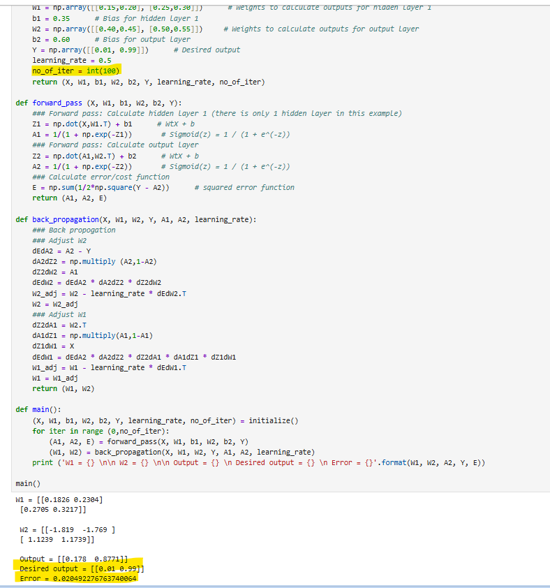
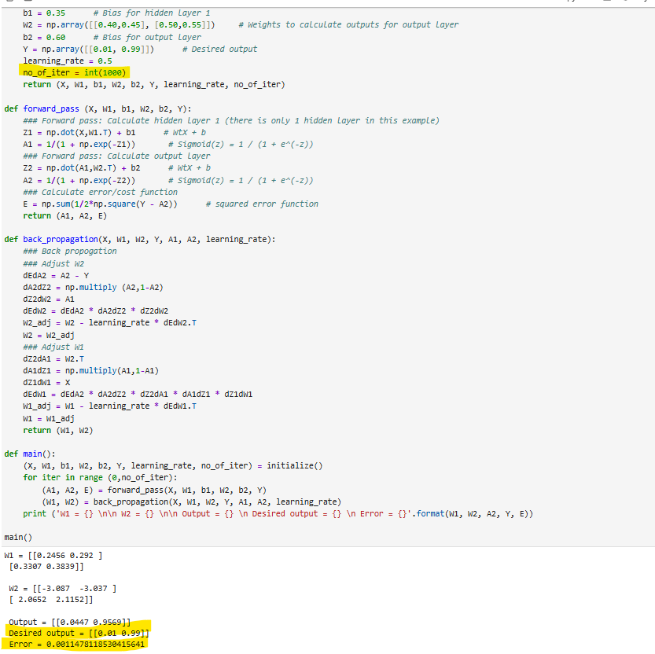
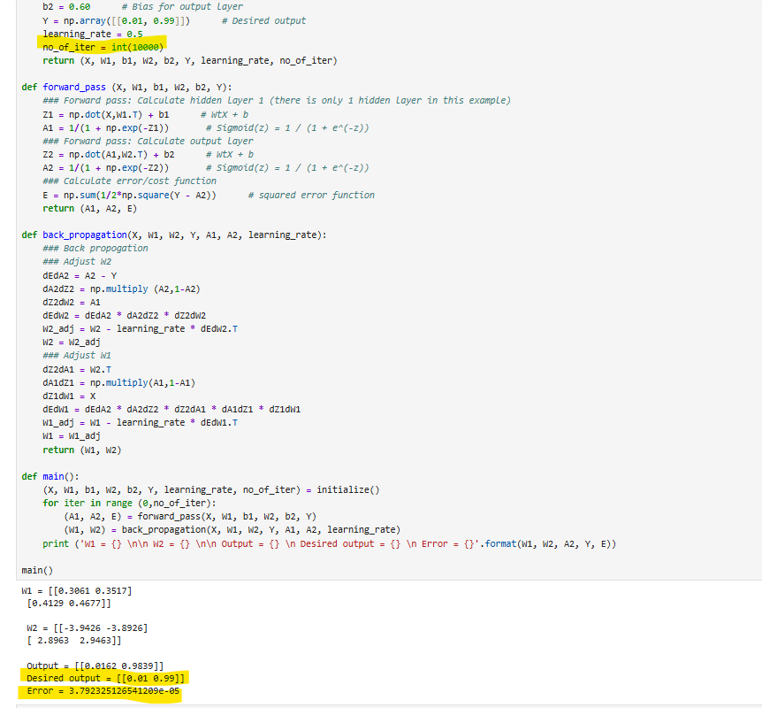

# SE4050-Deep-Learning-Lab-Sheet-2

## Lab 2: Introduction to Backpropagation and Feed-Forward Neural Networks

### Exercise 1: Backprop.ipynb

**Objective:** Understand the manual backpropagation implementation and observe the effect of increasing the number of iterations (epochs) on prediction accuracy.

**Setup**
- Environment: Anaconda (conda env `se4050`, Python 3.10)
- Packages: tensorflow, numpy, matplotlib, seaborn, scikit-learn, jupyter, notebook

**What was done**
The default notebook trains a simple 2-2-2 feed-forward network (2 inputs, 2 hidden units, 2 outputs) using manual forward propagation and backpropagation, based on Matt Mazur's step-by-step backpropagation example. The `no_of_iter` parameter inside `initialize()` was increased from its default value of 100, and the notebook was rerun at three different values to compare results.

**Results**

| Iterations | Final Output | Desired Output | Error |
|---|---|---|---|
| 100 | [0.178, 0.8771] | [0.01, 0.99] | 0.0205 |
| 1000 | [0.0447, 0.9569] | [0.01, 0.99] | 0.00115 |
| 10000 | [0.0162, 0.9839] | [0.01, 0.99] | 0.0000379 |

**At 100 iterations**

**At 1000 iterations**

**At 10000 iterations**

**Observation**

Increasing the number of iterations significantly improved the network's prediction accuracy. At 100 iterations, the error was 0.0205 with output [0.178, 0.8771]. Increasing to 1000 iterations reduced the error to 0.00115, and at 10000 iterations the error dropped further to 0.0000379, with the output [0.0162, 0.9839] nearly matching the desired output [0.01, 0.99]. This confirms that each backpropagation iteration adjusts the weights slightly in the direction that reduces error, so more iterations allow the network to converge closer to the optimal weights.

---

### Exercise 2: NN_sample.ipynb
*(to be added)*

### Exercise 3: MLP_with_MNIST_dataset.ipynb
*(to be added)*

---

## Repository Contents
- `Backprop.ipynb` - Modified notebook for Exercise 1 (10000 iterations, results visible)
- `image.png` - Supporting image for Backprop.ipynb
- `NN_sample.ipynb` - Modified notebook for Exercise 2
- `ex2_answers.txt` - Written answers to Exercise 2 questions
- `MLP_with_MNIST_dataset.ipynb` - Modified notebook for Exercise 3
